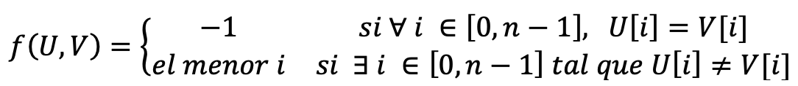

# Índice del problema

**Para volver a la lista haz clic [aquí](./Index.md)**

<!-- TOC -->
* [Índice del problema](#índice-del-problema)
* [Enunciado](#enunciado-)
    * [Problema 2 de la extraordinaria 21-22](#problema-2-de-la-extraordinaria-21-22)
* [Solución](#solución)
<!-- TOC -->


# Enunciado 

***

### Problema 2 de la extraordinaria 21-22

Implementa un algoritmo Divide y Vencerás  que calcule la siguiente función aplicada sobre dos vectores de enteros de igual tamaño:




# Solución

***

[Este problema](#enunciado-) se puede resolver en C de la siguiente forma:

```c
#define UMBRAL 1

int clasico(ivector u, ivector v, int i, int f){
    for (; i <= f; ++i)
        if (u[i] != v[i])
            return i;
    return -1;
}

/**
 *  a = 2
 *  b = 2
 *  r = 0   => 2 > 2^0
 *          => O(n^(log b (a)) = O (n)
 */
int funcionDyV(ivector u, ivector v, int i, int f) {
    int t = f - i + 1;
    if (t <= UMBRAL) {
        return clasico(u, v, i, f);
    } else {
        int m = i + (t/2);
        int izq = funcionDyV(u,v,i,m-1);
        if ( izq == -1 ) // 2a búsqueda 
            return funcionDyV(u,v,m,f);
        else // Si existe algún i, el menor está al principio
            return izq;
    }
}

```