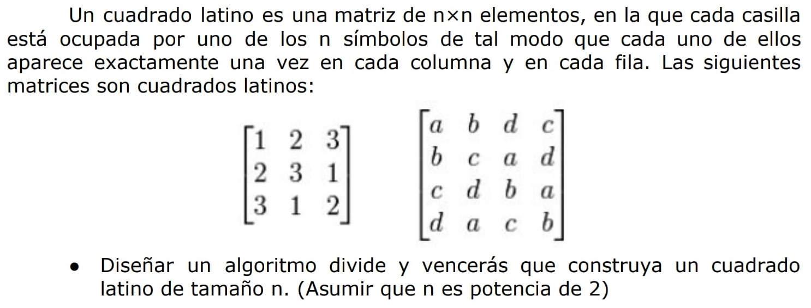

# Índice del problema

***

**Para volver a la lista haz clic [aquí](./Index.md)**

<!-- TOC -->
* [Índice del problema](#índice-del-problema)
* [Enunciado](#enunciado)
* [Solución](#solución)
    * [Salida de la solución 1](#salida-de-la-solución-1)
    * [Salida de la solución 2](#salida-de-la-solución-2)
    * [Salida de la solución 3](#salida-de-la-solución-3)
<!-- TOC -->

# Enunciado

***



# Solución
[Este problema](#enunciado) se puede resolver en C de la siguiente forma:

* Eficiencia del clasico: ``O(filas·columnas) = O(f·c) = O(n·n) = O(n^2)``
* Eficiencia del DyV:
  * ``a = 4``, ``b = 4``, ``r = 0``
  * ``4 > 4^0`` => ``O((f·c)^logb(a)) = O(f·c) = O(n^2)``
* Umbral:
  * ``f·c = 4 * ((f·c)/4)^2 + (f·c)^0``
  * ``f·c = 4 * (f·c)^2/4^2 + 1``
  * ``f·c = (f·c)^2/4 + 1`` => Tomamos ``x = f·c``
  * ``(x^2)/4 - x + 1 = 0`` => [Ecuación de 2º grado](https://es.wikipedia.org/wiki/Ecuaci%C3%B3n_de_segundo_grado#Soluciones_de_la_ecuaci%C3%B3n_de_segundo_grado)
  * Raíces: ``x=2`` y ``x=2``  => Siempre va a ser 2
  * ``x = f·c = 2`` => ``n^2 = 2`` => Tomamos esto último y no la raíz de ``n`` 

```c
#define UMBRAL 2
#define N /* Tamaño de la matriz cuadrada */

void clasico(imatriz2d mtx, int i, int iMax, int jMin, int jMax) {
    while (i <= iMax){
        for (int j = jMin; j <= jMax; ++j)
            mtx[i][j] = (i + j) % N;
        i++;
    }
}

void cuadradoLatino(imatriz2d mtx, int iMin, int iMax, int jMin, int jMax) {
    if ((iMax-iMin+1)*(jMax-jMin+1) <= UMBRAL) {
        clasico(mtx, iMin, iMax, jMin, jMax);
    } else {
        int iMid = (iMin + iMax) / 2;
        int jMid = (jMin + jMax) / 2;
        cuadradoLatino(mtx, iMin,       iMid, jMin,     jMid);
        cuadradoLatino(mtx, iMin,       iMid, jMid + 1, jMax);
        cuadradoLatino(mtx, iMid + 1,   iMax, jMin,     jMid);
        cuadradoLatino(mtx, iMid + 1,   iMax, jMid + 1, jMax);
    }
}
```

### Salida de la solución 1
```
0  1  2
1  2  0
2  0  1
```


### Salida de la solución 2
```
0  1  2  3  4
1  2  3  4  0
2  3  4  0  1
3  4  0  1  2
4  0  1  2  3
```


### Salida de la solución 3
```
0  1  2  3  4  5  6  7  8  9
1  2  3  4  5  6  7  8  9  0
2  3  4  5  6  7  8  9  0  1
3  4  5  6  7  8  9  0  1  2
4  5  6  7  8  9  0  1  2  3
5  6  7  8  9  0  1  2  3  4
6  7  8  9  0  1  2  3  4  5
7  8  9  0  1  2  3  4  5  6
8  9  0  1  2  3  4  5  6  7
9  0  1  2  3  4  5  6  7  8
```