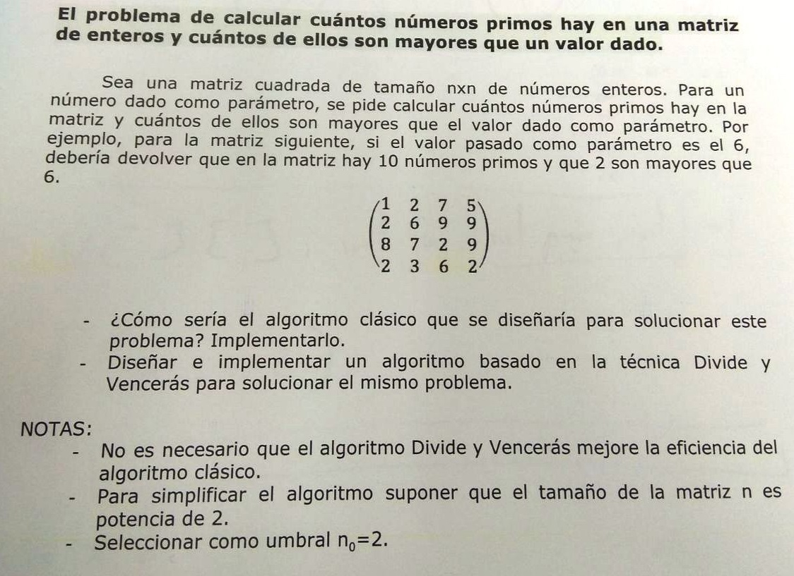

# Índice del problema

***

**Para volver a la lista haz clic [aquí](./Index.md)**

<!-- TOC -->
* [Índice del problema](#índice-del-problema)
* [Enunciado](#enunciado)
* [Solución](#solución)
    * [Salida de la solución](#salida-de-la-solución)
<!-- TOC -->

# Enunciado

***



# Solución
[Este problema](#enunciado) se puede resolver en C de la siguiente forma:

* Eficiencia del clasico: ``O(filas·columnas) = O(f·c) = O(n·n) = O(n^2)``
* Eficiencia del DyV:
  * ``a = 4``, ``b = 4``, ``r = 0``
  * ``4 > 4^0`` => ``O((f·c)^logb(a)) = O(f·c) = O(n^2)``
* Umbral:
  * ``f·c = 4 * ((f·c)/4)^2 + (f·c)^0``
  * ``f·c = 4 * (f·c)^2/4^2 + 1``
  * ``f·c = (f·c)^2/4 + 1`` => Tomamos ``x = f·c``
  * ``(x^2)/4 - x + 1 = 0`` => [Ecuación de 2º grado](https://es.wikipedia.org/wiki/Ecuaci%C3%B3n_de_segundo_grado#Soluciones_de_la_ecuaci%C3%B3n_de_segundo_grado)
  * Raíces: ``x=2`` y ``x=2``  => Siempre va a ser 2
  * ``x = f·c = 2`` => ``n^2 = 2`` => Tomamos esto último y no la raíz de ``n`` 

```c
#define VAL /* Valor que deben superar los números primos de la matriz */
#define UMBRAL 2
#define N   /* Tamaño de la matriz cuadrada */

int esPrimo(int numero) {   // Esta función se proporciona en el parcial
    if (numero <= 1) {
        return 0;           // Los números menores o iguales a 1 no son primos
    }

    for (int i = 2; i * i <= numero; i++) {
        if (numero % i == 0) {
            return 0;       // Si el número es divisible por algún número entre 2 y la raíz cuadrada, no es primo
        }
    }

    return 1;               // Si no se encontró ningún divisor, el número es primo
}

int clasico(imatriz2d mtx, int iIni, int iFin, int jIni, int jFin, int val) {
    int primos = 0, j;
    for (; iIni <= iFin; iIni++)
        for (j = jIni; j <= jFin ; ++j)
            if (mtx[iIni][j] > val && esPrimo(mtx[iIni][j]))
                ++primos;
    return primos;
}

int primosDyV(imatriz2d mtx, int iIni, int iFin, int jIni, int jFin, int val) {
    if ((iFin-iIni+1)*(jFin-jIni+1) <= UMBRAL) {
        return clasico(mtx, iIni, iFin, jIni, jFin, val);
    } else {
        int iMid = (iFin + iIni + 1) / 2;
        int jMid = (jFin + jIni + 1) / 2;
        int s = 0;
        s += primosDyV(mtx,     iIni,   iMid - 1,   jIni,  jMid - 1,    val);
        s += primosDyV(mtx,     iIni,   iMid - 1,   jMid,  jFin,        val);
        s += primosDyV(mtx,     iMid,   iFin,       jIni,  jMid - 1,    val);
        s += primosDyV(mtx,     iMid,   iFin,       jMid,  jFin,        val);
        return s;
    }
}
```

### Salida de la solución
```
Hay 3 numeros primos en la matriz mayores que 6:

(11)     14      14      16
 9       5      (7)      12
 15      6       15      5
(17)     3       16      10
```