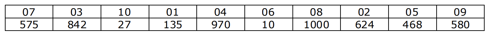

# Índice del problema

***

**Para volver a la lista haz clic [aquí](./Index.md)**

<!-- TOC -->
* [Índice del problema](#índice-del-problema)
* [Enunciado](#enunciado)
* [Solución](#solución)
    * [Salida de la solución](#salida-de-la-solución)
<!-- TOC -->

# Enunciado

***

Se ha celebrado una carrera de transporte de líquidos. En dicha carrera
todos los participantes parten con un recipiente encima de la cabeza que
tiene una capacidad ``C``, la misma para todos. 
Cuando cada uno de los participantes va llegando a la meta, entrega su recipiente y 
se anota el dorsal y la cantidad de líquido que han conseguido transportar. 

Por ejemplo, si hay 10 participantes y se mide en mililitros, los valores
anotados podrían ser los siguientes (dorsal y cantidad entregada):



Para los premios, se ha de conocer el dorsal del corredor que ocupa la
posición ``k`` (entre 1 y los ``n`` participantes) en función de la cantidad de
líquido entregada. Diseñar un algoritmo Divide y Vencerás para resolver
este problema.

**NOTA: No se puede hacer una ordenación total de los participantes
en función de la cantidad de líquido entregada.**

# Solución
[Este problema](#enunciado) se puede resolver en C de la siguiente forma:

- Eficiencia:
  - ``a = 1``, ``b = 2``, ``r = 0`` 
  - ``1 = 2^0`` => ``O(n^0 · logb(n)) = O(log2(n))``

>    - **NOTA:** para ``b`` se ha tomado en cuenta la eficiencia del 
>    - ``quicksort``, ya que este es una variación. La demostración de
>    - que vale 2 viene en el libro de Brassard y Bratley
- Umbral:
  - ``n^2 = 1 * (n/2)^2 + n^0``
  - ``n^2 = n^2/4 + 1``
  - ``(3/4) * n^2 = 1``
  - ``n = 2/sqrt(3) = 1.1547005 aprox. => n = 2``

### Algoritmo principal

```c
#define INVALIDO -1
#define UMBRAL 2

int clasico(ivector vMl, ivector vD, int i, int f, int k){
    if (i <= k && k <= f) {              // k está entre i y f
        while (i <= f){                  // ordenar elementos entre i y f
            int j = i+1;
            while (j <= f) {
                if (vMl[j] < vMl[i]) {
                    swap(vMl,j,i);
                    swap(vD,j,i);
                }
                j++;
            }
            ++i;
        }
        return k;                       // devolver k
    }
    return i;
}

int liquidos(ivector vMl, ivector vD, int i, int f, int k){
    int t = f-i+1;
    if (t <= UMBRAL){
        return clasico(vMl, vD, i, f, k);
    } else {
        int pivote = encuentraPivote(vMl,i,f);
        if (pivote == INVALIDO)
            return i;

        int idx = reordena(vMl,vD,i,f,vMl[pivote]);
        if (k < idx)
            return liquidos(vMl, vD, i,   idx-1, k);  // k estaría por la izquierda
        else
            return liquidos(vMl, vD, idx, f, k);      // k estaría por la derecha
    }
}
```

### Funciones auxiliares del algoritmo principal
````c
int encuentraPivote(ivector vMl, int i, int j){
    for (int k = i+1; k < j; ++k) {
        if (vMl[k] > vMl[i]) 
            return k;
        else if (vMl[k] < vMl[i]) 
            return i;
    }
    return INVALIDO;
}

int reordena(ivector vMl, ivector vD, int i, int j, int c){
    do{
        swap(vMl,i,j);
        swap(vD,i,j);                       // Además de modificar vMl, también vD
        while(vMl[i] < c)  i++;
        while(vMl[j] >= c) j--;
    }while(i <= j);
    return i;
}
````

### Salida de la solución

```
-------- ANTES DEL DYV ---------
Dorsales:       (0,   8,   2,   10,  9,   11, 5,   1,   7,   4,   6,   3  ),
Mililitros:     (100, 437, 612, 719, 238, 38, 365, 853, 855, 285, 797, 450),

-------- DESPUÉS DEL DYV ---------
Dorsales:       (11, 0,   9,   4,   5,   8,   3,   2,   10,  6,   1,   7  ),
Mililitros:     (38, 100, 238, 285, 365, 437, 450, 612, 719, 797, 853, 855),

----------------------------------
Indice del vector (k): 2, Dorsal: 9, Ml: 238
```