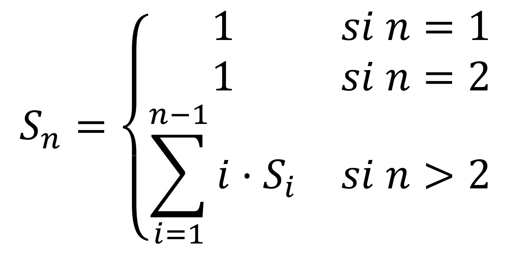

# Índice del problema

**Para volver a la lista haz clic [aquí](./Index.md)**

<!-- TOC -->
* [Índice del problema](#índice-del-problema)
* [Enunciado](#enunciado-)
    * [_Problema 3 de la ordinaria 14-15_](#problema-3-de-la-ordinaria-14-15)
* [Solución](#solución)
  * [Solución 1](#solución-1)
  * [Solución 2](#solución-2)
  * [Solución 3](#solución-3)
* [Funciones auxiliares](#funciones-auxiliares-)
  * [Para las soluciones](#para-las-soluciones)
  * [Para el recorrido](#para-el-recorrido)
* [Salidas de soluciones](#salidas-de-soluciones)
  * [Salida 1](#salida-1)
  * [Salida 2](#salida-2)
<!-- TOC -->


# Enunciado 

***

### _Problema 1 de junio del 11-12_

Diseña un algoritmo en O(n) basado en
programación dinámica (empleo de la memorización) para el cálculo de esta serie (1, 1, 3,
12, 60, 360…) cuyo término general es:



# Solución

***

[Este problema](#enunciado-) se puede resolver en C de la siguiente forma:

Complejidad del algoritmo: ``O(n^2)``


```c
#define N 12

int DA1112junio(int n){
    if (n <= 2) return 1;
    int i = 2, l = 1;
    while (i != n){
        l += i*l;
        ++i;
    }
    return l;
}

int main() {
    for (int i = 1; i <= N; ++i)
        printf("\nJunio1112: S(%i) es %i", i, DA1112junio(i));
    return 0;
}
```

# Salida de la solución

```
Junio1112: S(1) es 1
Junio1112: S(2) es 1
Junio1112: S(3) es 3
Junio1112: S(4) es 12
Junio1112: S(5) es 60
Junio1112: S(6) es 360
Junio1112: S(7) es 2520
Junio1112: S(8) es 20160
Junio1112: S(9) es 181440
Junio1112: S(10) es 1814400
Junio1112: S(11) es 19958400
Junio1112: S(12) es 239500800
```