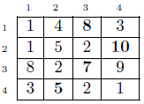

# Índice del problema

**Para volver a la lista haz clic [aquí](./Index.md)**

<!-- TOC -->
* [Índice del problema](#índice-del-problema)
* [Enunciado](#enunciado-)
    * [_Problema 3 de la ordinaria 14-15_](#problema-3-de-la-ordinaria-14-15)
* [Solución](#solución)
  * [Solución 1](#solución-1)
  * [Solución 2](#solución-2)
  * [Solución 3](#solución-3)
* [Funciones auxiliares](#funciones-auxiliares-)
  * [Para las soluciones](#para-las-soluciones)
  * [Para el recorrido](#para-el-recorrido)
* [Salidas de soluciones](#salidas-de-soluciones)
  * [Salida 1](#salida-1)
  * [Salida 2](#salida-2)
<!-- TOC -->


# Enunciado 

***

### _Problema 3 de la ordinaria 14-15_

Queremos jugar a un juego en el que tenemos un tablero ``n × n`` donde en
cada casilla aparece un número natural. 

El juego consiste en elegir una casilla de la
última fila (``n``) y movernos desde ella hasta una casilla de la primera fila (``1``), donde los
únicos movimientos legales consisten en moverse, sin salirse del tablero, de una
casilla a una de las tres casillas de la fila superior alcanzables en vertical o en
diagonal. 

La cantidad ganada será la suma de los valores en las casillas del tablero
por las que pasamos en este recorrido.


**Ejemplo**: 



Si este fuese el tablero, tendríamos que empezar en la casilla (4, 2), y 
después pasar por las casillas (3, 3), (2, 4) y (1, 3), obteniendo una ganancia de 30.

Escribir un algoritmo basado en Programación Dinámica que determine, dado un
tablero, cuál es la casilla de la última fila por la que interesa empezar y por qué
casillas hay que pasar para obtener la ganancia máxima.

# Solución

## Solución 1

***

[Este problema](#enunciado-) se puede resolver en C de la siguiente forma:

Complejidad del algoritmo: ``O(n^2)``


```c
#define N 4

void pdMayo2015sol1(imatriz2d mtx) {
    imatriz2d G = icreamatriz2d(N,N);

    int i, j, temp = -1, k;

    for (j=0; j < N; ++j)
        G[N-1][j] = mtx[N-1][j];                                // Copias solo la fila de abajo

    for (i=N-2; i >= 0; --i)
        for (j=0; j < N; ++j) {
            temp = max(temp, G[i+1][ j ] + mtx[i][j]);          // Modificas en vertical
            if (j != N-1)
                temp = max(temp, G[i+1][j+1] + mtx[i][j]);      // Modificas la diagonal derecha
            if (j != 0)
                temp = max(temp, G[i+1][j-1] + mtx[i][j]);      // Modificas la diagonal izquierda

            G[i][j] = temp;
        }

    k = 0;
    temp = mtx[0][0];
    for (j=1; j < N; ++j)
        if (temp < G[0][j]){
            temp = G[0][j];
            k = j;
        }

    printf("\nLa ganancia es de %i, y el recorrido es:",temp);
    recorrido(mtx,0,k,temp);

    ifreematriz2d(&G);
}
```

## Solución 2

***

[Este problema](#enunciado-) se puede resolver en C de la siguiente forma:

Complejidad del algoritmo: ``O(n^2)``

```c
#define N 4

void pdMayo2015sol2(imatriz2d mtx) {
    imatriz2d G = icreamatriz2d(N,N);
    int i, j;

    for (j=0; j < N; ++j)
        G[N-1][j] = mtx[N-1][j];                // Copias la última fila, que no va a ser modificada

    for (i=N-2; i >= 0; --i)
        for (j=0; j < N; ++j)
            sumVert(G,mtx,i,j);                 // Das por supuesto que el máximo es en vertical

    for (i=N-2; i >= 0; --i)
        for (j=0; j < N; ++j) {
            if (j != N-1)
                sumDiagDer(G,mtx,i,j);          // Diagonal derecha
            if (j != 0)
                sumDiagIzq(G,mtx,i,j);          // Diagonal izquierda
        }

    int max = mtx[0][0], k = 0;
    for (j=1; j < N; ++j)
        if (max < G[0][j]) {
            max = G[0][j];
            k = j;
        }

    printf("\nLa ganancia es de %i, y el recorrido es:",max);
    recorrido(mtx,0,k,max);

    ifreematriz2d(&G);
}
```

## Solución 3

***

[Este problema](#enunciado-) se puede resolver en C de la siguiente forma:

Complejidad del algoritmo: ``O(n^2)``

```c
#define N 4

void pdMayo2015sol3(imatriz2d mtx) {    // Esta versión es más completa, y puede llevar más tiempo lograrla, por lo
    imatriz2d G = icreamatriz2d(N,N);   // que es preferible obtener las otras soluciones durante el examen
    int i, j;                           // Es más eficiente que las anteriores, pues reduce las constantes de complejidad

    for (j=0; j < N; ++j)
        G[N-1][j] = mtx[N-1][j];        // Copias la última fila, que nunca va a ser modificada

    for (i=N-2; i >= 0; --i)
        for (j=0; j < N; ++j)
            sumVert(G,mtx,i,j);         // Das por supuesto que el máximo va a ser en vertical

    for (i=N-2; i >= 0; --i) {
        sumDiagDer(G,mtx,i,0);          // Columna de la izquierda (0)
        for (j=1; j < N-1; ++j) {
            sumDiagDer(G,mtx,i,j);      // Columnas intermedias
            sumDiagIzq(G,mtx,i,j);
        }
        sumDiagIzq(G,mtx,i,N-1);        // Columna de la derecha (N-1)
    }

    int max = mtx[0][0], k = 0;
    for (j=1; j < N; ++j)
        if (max < G[0][j]) {
            max = G[0][j];
            k = j;
        }

    printf("\nLa ganancia es de %i, y el recorrido es:",max);
    recorrido(mtx,0,k,max);

    ifreematriz2d(&G);
}
```

# Funciones auxiliares 
## Para las soluciones

Para la [solución 1](#solución-1)

````c
int max (int a , int b) { 
    return a > b ? a : b;
}
````

Para la [solución 2](#solución-2) y la [solución 3](#solución-3)

````c
void sumVert(imatriz2d G, imatriz2d mtx, int i, int j) {
    G[i][j] = mtx[i][j] + G[i+1][j];
}

void sumDiagIzq(imatriz2d G, imatriz2d mtx, int i, int j) {
    int temp = mtx[i][j] + G[i+1][j-1];
    if (G[i][j] < temp)
        G[i][j] = temp;
}

void sumDiagDer(imatriz2d G, imatriz2d mtx, int i, int j) {
    int temp = mtx[i][j] + G[i+1][j+1];
    if (G[i][j] < temp)
        G[i][j] = temp;
}
````

## Para el recorrido
````c
int contAux=1;

int msjCasilla(int i, int j, imatriz2d mtx){
    printf("\n%i:\t(%i,%i) = %i",contAux++,i+1,j+1,mtx[i][j]);
    return 1;
}

int recorrido(imatriz2d mtx, int i, int j, int s){
    if (s==mtx[i][j] && i == N-1){
        return msjCasilla(i,j,mtx);
    }else if (i+1 < N) {
            if (recorrido(mtx,i+1,j,s-mtx[i][j]))       // Vertical
                return msjCasilla(i,j,mtx);
        if (j != N-1)
            if (recorrido(mtx,i+1,j+1,s-mtx[i][j]))     // Diagonal derecha
                return msjCasilla(i,j,mtx);
        if (j != 0)
            if (recorrido(mtx,i+1,j-1,s-mtx[i][j]))     // Diagonal izquierda
                return msjCasilla(i,j,mtx);
    }
    return 0;
}
````


# Salidas de soluciones

## Salida 1

```
1:      9       4       10      6
2:      7       10      1       3
3:      7       3       7       6
4:      5       6       9       6

La ganancia es de 36, y el recorrido es:
1:      (4,3) = 9
2:      (3,3) = 7
3:      (2,2) = 10
4:      (1,3) = 10
```

## Salida 2

```
1:      9       4       10      6       7       10      1       3
2:      7       3       7       6       5       6       9       6
3:      4       5       2       7       4       4       1       9
4:      2       1       1       1       8       7       3       7
5:      2       3       4       1       9       10      3       2
6:      8       2       4       3       2       8       10      4
7:      4       5       6       6       7       2       1       10
8:      6       1       8       1       8       6       9       1

La ganancia es de 70, y el recorrido es:
1:      (8,7) = 9
2:      (7,8) = 10
3:      (6,7) = 10
4:      (5,6) = 10
5:      (4,7) = 3
6:      (3,8) = 9
7:      (2,7) = 9
8:      (1,6) = 10
```
