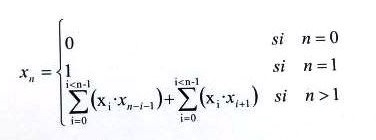

# Índice del problema

**Para volver a la lista haz clic [aquí](./Index.md)**

<!-- TOC -->
* [Índice del problema](#índice-del-problema)
* [Enunciado](#enunciado)
* [Solución](#solución)
<!-- TOC -->

# Enunciado


# Solución
[Este problema](#enunciado) se puede resolver en C de la siguiente forma:

```c
int funcion(int n) {
    if (n < 2) 
        return n;

    ivector v = icreavector(n+1);
    v[0]=0;                                     // Casos base
    v[1]=1;
    int i;
    for (int k = 2; k <= n; ++k) {              // Creo desde k=2 hasta el valor n incluido
        v[k] = 0;                               // Valor a 0 para hacer la sumatoria
        for (i = 0; i < k - 1; ++i)             // Mientras i < n-1 en cada etapa k
            v[k] += v[i] * (v[k-1-i] + v[i+1]); // Simplificación de la fórmula.
    }

    i = v[n];
    ifreevector(&v);
    return i;
}
```

