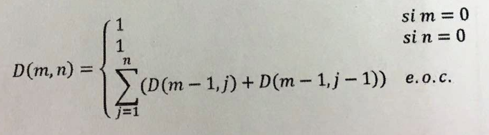

# Índice del problema

***

**Para volver a la lista haz clic [aquí](./Index.md)**

<!-- TOC -->
* [Índice del problema](#índice-del-problema)
* [Enunciado](#enunciado)
* [Solución](#solución)
<!-- TOC -->

# Enunciado

***



# Solución

***

[Este problema](#enunciado) se puede resolver en C de la siguiente forma:

```c
int funcion(int n, int m) {
    if (!n || !m) 
        return 1;

    int i,j,k;
    imatriz2d D = icreamatriz2d(m+1,n+1);
    for ( i = 0; i <=m ; ++i)
        for ( j = 0; j <= n; ++j) {
            D[i][j] = (!i || !j) ? 1 : 0;    // Si es base vale 1. En otro caso pongo 0 para sumatoria
            if (D[i][j] == 0)                // Pregunto si se va a hacer sumatoria (D[i][j] ya es 0)
                for ( k = 1; k <= n; ++k)    // 
                    D[i][j] += D[k][j - 1] + D[k - 1][j - 1];
        }

    k = D[n][m];        // Como no voy a usarlo más, reuso la k para otro fin
    ifreematriz2d(&D);
    return k;
```

