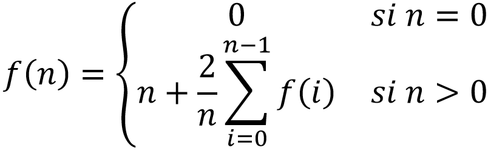

# Índice del problema

**Para volver a la lista haz clic [aquí](./Index.md)**

<!-- TOC -->
* [Apartados](#apartados)
* [Enunciado](#enunciado)
* [Solución](#solución)
<!-- TOC -->

# Enunciado
Implementa un algoritmo Basado en Programación dinámica que calcule la siguiente
función:


# Solución
[Este problema](#enunciado) se puede resolver en C de la siguiente forma:

```c
float funcion(int n){
    if (!n)                         // !0 es TRUE
        return 0.f;                 
    float i_ = 1.f, f_n;
    for (int i = 0; i <= n - 1; ++i) {
        f_n = i_ + (2.f/i_) * f_n;  // Aprovecho el valor de f_n antes de actualizarse
        i_ += 1.f;
    }
    return f_n;
}
```

