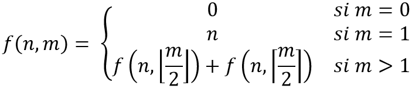

# Índice del problema

**Para volver a la lista haz clic [aquí](./Index.md)**

<!-- TOC -->
* [Índice del problema](#índice-del-problema)
* [Enunciado](#enunciado)
* [Solución](#solución)
<!-- TOC -->

# Enunciado
Implementa un algoritmo Basado en Programación dinámica que calcule la siguiente
función:


# Solución
[Este problema](#enunciado) se puede resolver en C de la siguiente forma:

```c
float funcion(int n, int m) { 
    if (!m)     return 0.f;
    if (m==1)   return (float)n;

    float sumatoria = 0.f;
    float m_float = 0.0f;
    for (int m_contador = 0; m_contador <= m; ++m_contador) {
        sumatoria +=    floorf(m_float) + ceilf(m_float);
        m_float =       0.5f * (float)m_contador;
    }
    return sumatoria;
}
```

