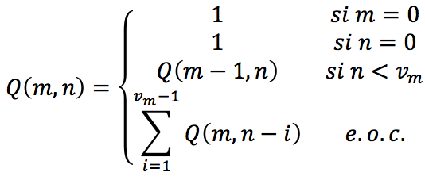

# Índice del problema

**Para volver a la lista haz clic [aquí](./Index.md)**

<!-- TOC -->
* [Índice del problema](#índice-del-problema)
* [Enunciado](#enunciado)
* [Solución](#solución)
<!-- TOC -->

# Enunciado
Implementa un algoritmo basado en PD que, dados dos valores enteros ``m, n``, y un ``vector V``
que como mínimo tenga ``m+1 elementos``, calcule el valor de Q(m, n) según la siguiente
función:



# Solución
[Este problema](#enunciado) se puede resolver en C de la siguiente forma:

```c
int funcion(int n, int m, ivector iv) {
    if (!n || !m) 
        return 1;
    
    imatriz2d mtx = icreamatriz2d(m+1, n + 1);  // Número de casos (casos base y con solapamiento)
    
    int i,j,k;                                  // Casos base
    for (i=0; i<=m; ++i) mtx[i][0] = 1;         // Primera columna (la m son filas)
    for (i=0; i<=n; ++i) mtx[0][i] = 1;         // Primera fila (la n son columnas)

    for (i=1; i<=m; ++i)                        // Empieza la construcción de la solución
        for (j = 1; j <= n; ++j) {              // Empieza en [1][1], pues [0][0] ya son es el caso base
            mtx[i][j] = mtx[i-1][j];            // Asigno valor ( supongo que no entrará en el if{} )
            if (j >= iv[i-1]) {                 // n >= v_m
                mtx[i][j] = 0;                  // Valor a 0 para hacer la sumatoria
                for (k = 1; k <= iv[i] -1; ++k) // Desde 1 hasta v_m - 1
                    mtx[i][j] += mtx[i][j-k];   // Q(n,n) = SUM[Q(n, n-k)]
            }
        }

    k = mtx[m][n];
    ifreematriz2d(&mtx);
    return k;
}
```

```c
#define N ... /* Cualquier número */
#define M ... /* Cualquier número */

int main() {
    ivector fv = icreavector(M+1);
    for (int i = 0; i < M + 1; ++i)
        fv[i] = ... /* Cualquier secuencia de números */
    printf("f(%i,%i,fv) = %i\n", N, M, fx3(N,M,fv));
    ifreevector(&fv);
    return 0;
}
```

