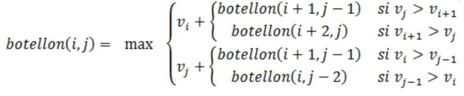

# Índice del problema

***

**Para volver a la lista haz clic [aquí](./Index.md)**

<!-- TOC -->
* [Índice del problema](#índice-del-problema)
* [Enunciado](#enunciado)
* [Soluciones](#soluciones)
  * [Solución 1](#solución-1)
  * [Solución 2](#solución-2)
* [Salida de la solución](#salida-de-la-solución)
<!-- TOC -->

# Enunciado

***

Dos amigos, Agonioso y Listillo, salen de botellón. 

La nueva moda es poner una fila con ``n`` vasos (n es par). Cada vaso ``i``, entre ``1`` y ``n``
contiene una cantidad de líquido ``c[i]`` distinta. 

Los amigos beben por turnos. Cada uno, en su turno debe elegir el vaso de uno de los extremos
y beberse su contenido. El vaso se retira y el turno pasa al otro amigo. 

La persona que comienza bebiendo se determina a priori por un procedimiento cualquiera. El objetivo de
ambos amigos es beber la mayor cantidad posible de líquido.

La estrategia de Agonioso consiste en pensar poco y coger el vaso de los extremos
que esté más lleno. En cambio Listillo prefiere pensárselo un poco más.
> * a) Demostrar, con un contraejemplo que la estrategia de Agonioso no es óptima,
> incluso cuando le toca escoger primero.
>
> 
> * b) Listillo tiene unos amigos que cursan la asignatura de Diseño de Algoritmos y les
> pide que le diseñen un algoritmo, basado en Programación Dinámica, para que le
> ayude a conseguir su objetivo, suponiendo que es él quien empieza a escoger.
>
> **Guía**: Definir una función ``botellón(i,j)`` que represente la cantidad máxima que bebe
> Listillo con los vasos desde el i hasta el j cuando le toca empezar a beber. La
> solución final será ``botellón(1,n)``

# Soluciones

Formulación recursiva:



## Solución 1

***

[Este problema](#enunciado) se puede resolver en C de la siguiente forma:

```c
#define N 10 // <- N es un número par

int max(int a, int b) {
    return a < b ? a : b;
}

int botellonPD(ivector vasos) {

    imatriz2d tomar = icreamatriz2d(N, N);
    for (int i = 0; i < N-1; ++i)           // Inicializas diagonal con casos base: máximo entre dos vasos
        tomar[i][i + 1] = max(vasos[i], vasos[i + 1]);

    int bebo_i, bebo_j, j;
    for (int d = 3; d < N; d+=2)            // Recorre diagonales, a partir de la 2ª. Tomar tras Agonioso (+=2)
        for (int i = 0; i < N - d; ++i) {   //
            j = i + d;                      // i siempre es par, j siempre es impar
            bebo_i = vasos[j] > vasos[i+1] ? tomar[i + 1][j - 1] : tomar[i + 2][j];
            bebo_j = vasos[i] > vasos[j-1] ? tomar[i + 1][j - 1] : tomar[i][j - 2];
            tomar[i][j] = max(vasos[i] + bebo_i, vasos[j] + bebo_j);
        }

    int maximo = tomar[0][N - 1];
    ifreematriz2d(&tomar);
    return maximo;
}
```

## Solución 2

***

[Este problema](#enunciado) se puede resolver en C de la siguiente forma:

```c
#define N 10 // <- N es un número par

int max(int a, int b) {
    return a < b ? a : b;
}

int botellonPD(ivector vasos) {

    imatriz2d tomar = icreamatriz2d(N, N);
    for (int i = 0; i < N-1; ++i)           // Inicializas diagonal con casos base: máximo entre dos vasos
        tomar[i][i + 1] = max(vasos[i], vasos[i + 1]);

    int bebo_i, bebo_j, j;
    for (int d = 3; d < N; d+=2)            // Recorre diagonales, a partir de la 2ª. Tomar tras Agonioso (+=2)
        for (int i = 0; i < N - d; ++i) {   //
            j = i + d;                      // i siempre es par, j siempre es impar
            bebo_i = bebo_j = tomar[i+1][j-1];
            if (vasos[j] <= vasos[i+1]) bebo_i = tomar[i + 2][j];
            if (vasos[i] <= vasos[j-1]) bebo_j = tomar[i][j - 2];
            tomar[i][j] = max(vasos[i] + bebo_i, vasos[j] + bebo_j);
        }

    int maximo = tomar[0][N - 1];
    ifreematriz2d(&tomar);
    return maximo;
```

# Salida de la solución

***

```
Vasos:
8       4       3       10      2       9       8       3       8       1

Matriz del algoritmo:
-1      4       -1      11      -1      13      -1      16      -1      17
-1      -1      3       -1      5       -1      9       -1      12      -1
-1      -1      -1      3       -1      5       -1      8       -1      9
-1      -1      -1      -1      2       -1      10      -1      13      -1
-1      -1      -1      -1      -1      2       -1      5       -1      6
-1      -1      -1      -1      -1      -1      8       -1      11      -1
-1      -1      -1      -1      -1      -1      -1      3       -1      4
-1      -1      -1      -1      -1      -1      -1      -1      3       -1
-1      -1      -1      -1      -1      -1      -1      -1      -1      1
-1      -1      -1      -1      -1      -1      -1      -1      -1      -1

Maximo que puede beber Listillo: 17
```

