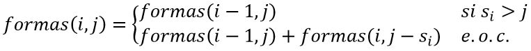

# Índice del problema

**Para volver a la lista haz clic [aquí](./Index.md)**

<!-- TOC -->
* [Índice del problema](#índice-del-problema)
* [Enunciado](#enunciado)
* [Solución 1](#solución-1)
* [Solución 2](#solución-2)
* [Programa principal](#programa-principal)
<!-- TOC -->

# Enunciado
En un determinado país se emiten ``n`` sellos diferentes de
valores naturales positivos ``s1, s2, …, sn``. Se quiere enviar
una carta y se sabe que la correspondiente tarifa postal es ``T``. 

¿De cuántas formas diferentes se puede franquear exactamente la carta, si el orden de los sellos no importa?

Para solucionar este problema se puede definir la función:
``formas(n, T) = número de formas de franquear T con n tipos de sellos``

Ahora hay que dar una definición recursiva del algoritmo:
 - ``formas(i, j): usar los sellos del 1 al i para franquear la cantidad j``
 - No podemos usar un sello (_i_) de 50 para franquear 25, por lo que el número de formas no cambia
   - Si ``s[i] > j ``, entonces ``formas(i, j) = formas(i-1, j)``
 - Podemos usar un sello (_i_) de 10 para franquear 25, pero también podemos elegir no hacerlo 
   - Si ``s[i] <= j ``, entonces ``formas(i, j) = formas(i-1, j) + formas(i, j-s[i])``



Para los casos base:
 - ``formas(0, j) = 0`` ∀ ``j`` ∊ [1, T]
 - ``formas(i, 0) = 1`` ∀ ``i`` ∊ [0, n]

# Solución 1
[Este problema](#enunciado) se puede resolver en C de la siguiente forma:

```c
/**
 * Algoritmo que resuelve el problema de la tarificación postal.
 * [sellos] Es el vector que contiene los sellos con los que franquear
 * [n] Es el número de sellos total
 * [T] Es la cantidad de la tarifa correspondiente
 */
int postal1(ivector sellos, int n, int T){
    int i, j;
    imatriz2d mtx = icreamatriz2d(n+1, T+1);    // 1 hilera más por los casos base
    for (i = 0; i <= n; ++i)                    // La fila 0 es para cuando no hay sellos
        for ( j = 1; j <= T; ++j)
            mtx[i][j] = 0;
    
    for (i = 1; i <= n; ++i)    mtx[i][0] = 1;  // Columna 0 cuando no hay franqueo; 1 forma, sin sellos
    
    for ( i = 1; i <= n; ++i)
        for ( j = 1; j <= T; ++j) {
            mtx[i][j] = mtx[i-1][j];            // Se parte de las formas que ya hay (casilla de arriba)
            if (sellos[i-1] <= j)               // Si se puede usar el sello, se añade
                mtx[i][j] += mtx[i][j - sellos[i-1]];
        }
    
    i = mtx[n][T];                              // Tomamos la última casilla, que guarda el valor máximo
    ifreematriz2d(&mtx);
    return i;
}
```

# Solución 2
[Este problema](#enunciado) se puede resolver en C de la siguiente forma:

```c
/**
 * Como solo interesa el número de formas, se puede tener un vector
 * que contenga las formas distintas, en lugar de tener una matriz
 * que contenga todos los valores de recurrencia.
 *
 * El algoritmo es O(sellos * tarifa) en tiempo y O(tarifa) en espacio
 */
int postal2(ivector sellos, int n, int T){
    int i,j;
    ivector formas = icreavector(T+1);
                                                // -- Casos base --
    formas[0] = 1;                              // Cuando la cantidad a franquear es 0: 1 forma
    for (i = 1; i <= T; ++i)
        formas[i] = 0;                          // Cuando no quedasen sellos: 0 formas
    
    for (i = 1; i <= n; ++i)                    // Recorremos los sellos 
        for (j = sellos[i-1]; j <= T; ++j)      // Bucle que suma las formas de usar los sellos
            formas[j] += formas[j-sellos[i-1]];
    
    i = formas[T];                              // Reutilizo i para guardar el valor máximo de formas
    ifreevector(&formas);
    return i;
}
```

# Programa principal

```c
#define NUM_SELLOS ...  /* Número entero mayor o igual que 0 */
#define TARIFA  ...     /* Número entero mayor o igual que 0 */

int main() {
     ivector sellos = icreavector(NUM_SELLOS);
     sellos[0] = ... /* Entero positivo para este sello */
     sellos[1] = ... /* Entero positivo para este sello */
     sellos[2] = ... /* Entero positivo para este sello */
     /* ... */
     
     printf("\nHay %i formas de franquear una tarifa %i con los sellos: ", postal1(sellos, NUM_SELLOS, TARIFA), TARIFA);
     for (int i = 0; i < NUM_SELLOS; ++i)
         printf("%i, ", sellos[i]);
     
     printf("\n\nHay %i forma de franquear una tarifa %i con los sellos: ", postal2(sellos, NUM_SELLOS, TARIFA), TARIFA);
     for (int i = 0; i < NUM_SELLOS; ++i)
         printf("%i, ", sellos[i]);

    ifreevector(&sellos);
    return 0;
}
```
