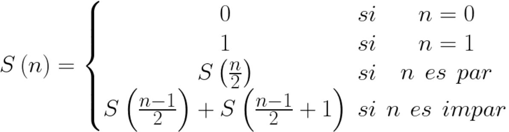

# Índice del problema

**Para volver a la lista haz clic [aquí](./Index.md)**

<!-- TOC -->
* [Índice del problema](#índice-del-problema)
* [Enunciado](#enunciado)
* [Solución](#solución)
<!-- TOC -->

# Enunciado
Implementar un algoritmo basado en programación dinámica que calcule el término ``n-ésimo`` de la serie de Stern:


Los primeros términos de la serie son: ``0, 1, 1, 2, 1, 3, 2, 3,
1, 4, 3, 5, 2, 5, 3, 4, 1, 5, 4, 7, 3, 8, 5, 7, 2, 7, 5, 8, 3, 7, 4, 5,
1, 6, 5, 9, 4, 11, 7, 10, 3, 11, 8, 13, 5, 12, 7, 9, 2, 9, 7, 12, 5,
13, 8, 11, 3, 10, 7, 11, 4, 9, 5, 6, 1, 7, 6, 11, 5, 14, 9…``

# Solución
[Este problema](#enunciado) se puede resolver en C de la siguiente forma:

```c
/**
 * Función para calcular la serie de Stern con programación dinámica
 */
int stern(int n){
    if (n < 2)
        return n;               // Si n==0, s(n)=0. También, si n==1, s(n)=1
    
    ivector vector = icreavector(n+1);
    vector[0]=0;
    vector[1]=1;
    int i;
    for (i = 2; i <= n; ++i)
        if(i%2==0)      
            vector[i] = vector[i/2];
        else            
            vector[i] = vector[(i-1)/2] + vector[((i-1)/2)+1];
    
    i = vector[n];              // Reutilizo la i, antes de liberar el vector
    ifreevector(&vector);
    return i;
}
```

