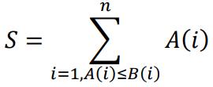

# Índice del problema

***

**Para volver a la lista haz clic [aquí](./Index.md)**

<!-- TOC -->
* [Índice del problema](#índice-del-problema)
* [Enunciado](#enunciado)
* [Solución](#solución)
    * [Algoritmo principal](#algoritmo-principal)
    * [Funciones auxilares del algoritmo principal](#funciones-auxilares-del-algoritmo-principal)
    * [Salida de la solución](#salida-de-la-solución)
<!-- TOC -->

# Enunciado

***

Sean los vectores A y B de n números naturales cada uno, el primero de los
cuales, A, está ordenado crecientemente. 

Implementa un algoritmo voraz que obtenga una reordenación del vector B tal 
que maximice la suma de los elementos de A que no superan al elemento 
correspondiente de B.



Ejemplo: 
- A = {1, 4, 6, 7, 9}
- B = {3, 2, 4, 6, 5}

Una posible reordenación de B (no la óptima) podría ser: B = {2, 4, 5, 3, 6}

Obtendremos un valor de S = 1 + 4 = 5 

¿Cuál sería la solución óptima para este ejemplo?


# Solución
[Este problema](#enunciado) se puede resolver en C de la siguiente forma:

### Algoritmo principal

```c
#define N /* Tamaño de los vectores */

int seleccion(int valA, ivector b, ivector usos) {
    int idx = -1, hayMayores = 0;

    for (int i = 0; i < N; ++i)
        if (usos[i]) {
            idx = i;                        // Hay un índice válido a retornar como solución
            hayMayores |= (!hayMayores && valA <= b[i]); // Centinela del if: b[i] mayor o igual que valA
        }

    int M = valA - 1, m = valA + 1;         // Máximo y mínimo
    for (int i = 0; i < N; ++i)
        if (usos[i]) {                      // Busca, si no se ha usado, el máx. o mín. de b, según si hay mayores a valA o no
            int aux = hayMayores ? max(M,b[i]) : min (m,b[i]);
            if (aux != M || aux != m){
                M = m = b[i];               // Como solo se busca el mayor o el menor, se pueden asignar ambos sin problemas
                idx = i;
            }
        }

    return idx;
}

ivector reordenaGreedy(ivector a, ivector b){
    ivector indices = icreavector(N);
    ivector usos = icreavector(N);
    for (int i = 0; i < N; ++i)
        usos[i] = 1;

    int i = N - 1;
    int idx;
    while (!solucion(i)){
        idx = seleccion(a[i], b, usos);
        if (factible(idx)){
            usos[idx] = 0;
            indices[i--] = idx;
        }
    }

    ifreevector(&usos);
    return indices;
}
```

### Funciones auxilares del algoritmo principal

````c
int factible(int idx) {
    return 0 <= idx && idx < N;
}

int solucion(int i) {
    return i < 0 || i >= N;
}

int max (int max1, int max2) {
    return max1 > max2 ? max1 : max2;
}

int min (int min1, int min2) {
    return min1 < min2 ? min1 : min2;
}
````

### Salida de la solución

```
(5      39      60      97      106     121     128     130     137     151     174     198     206)
(159    44      65      146     118     147     4       12      151     22      26      118     37)

===========      REORDENACION   ===========
(5      39      60      97      106     121     128     130     137     151     174     198     206)
(37     44      65      118     118     26      146     147     151     159     22      12      4       )

===========      SUMA           ===========
 5      39      60      97      106     0       128     130     137     151     0       0       0
Total: 853
```