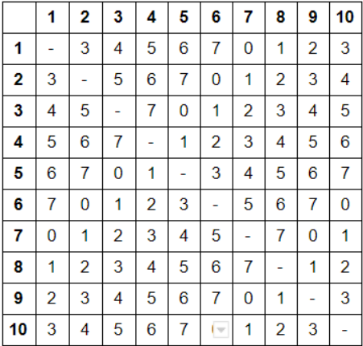

# Índice del problema

***

**Para volver a la lista haz clic [aquí](./Index.md)**

<!-- TOC -->
* [Índice del problema](#índice-del-problema)
* [Enunciado](#enunciado)
* [Solución](#solución)
    * [Algoritmo principal](#algoritmo-principal)
    * [Funciones auxilares del algoritmo principal](#funciones-auxilares-del-algoritmo-principal)
    * [Programa principal](#programa-principal)
    * [Salida de la solución](#salida-de-la-solución)
<!-- TOC -->

# Enunciado

***

Una empresa pleistocénica dispone de 10 ordenadores conectados todos
entre sí por una tupida red de conexiones punto a punto. 

Cada conexión C(i, j) entre el nodo i y j (con i, j ∈ {1. .10}) tiene un coste asignado que sigue la fórmula
C(i, j) = (i+j) % 8

Tras la contratación de un ingeniero en informática de la UJA, la 
empresa consiente la modernización de sus conexiones asegurando la
conectividad de su red de nodos y minimizando el coste. Diseñar un
algoritmo voraz que resuelva el problema y aplicarlo a los datos del enunciado.




# Solución
[Este problema](#enunciado) se puede resolver en C de la siguiente forma:

### Algoritmo principal

```c
/**
 * @return Conjunto de aristas (una arista es una columna de la matriz)
 * La 2 filas indican los 2 nodos que conforman la arista
 * Usar cuando hay grafos densos ( a = n^2 )
 */
imatriz2d prim(imatriz2d dist) {
    imatriz2d aristas = icreamatriz2d(2,N-1);   // Para N nodos, hay (N-1) aristas
    ivector masCerca = icreavector(N);
    ivector minDist = icreavector(N);
  
    for (int i = 1; i < N; ++i) {               // Solo entre 1 y N-1: el 0 no tiene sentido (el mismo nodo)
        masCerca[i] = 0;                        // Establece el nodo más cercano
        minDist[i] = dist[0][i];                // Copias el coste del primer nodo (el 0)
    }
  
    int min, j, k;
    for (int i = 0; i < N - 1; ++i) {           // Bucle N-1 veces

        min = INF;
        for (j = 1; j < N; ++j)
            if ( minDist[j] < min && INVALIDO != minDist[j] ) {
                min = minDist[j];               // Buscas la distancia mínima para el nodo actual
                k = j;                          // Guardas dicho nodo (k)
            }
    
        aristas[0][i] = k;                      // Guardo la arista ( el par de nodos {k, masCerca[k]} )
        aristas[1][i] = masCerca[k];            //
        minDist[k] = INVALIDO;                  // Como se ha escogido la arista, invalidamos la distancia para k
    
        for (j = 1; j < N; ++j)                 // Actualiza minDist y masCerca para la siguiente iteracion
            if (dist[k][j] < minDist[j]) {      // Si hay un coste que es menor al supuesto ..
                minDist[j] = dist[k][j];        // .. se actualiza por el nuevo mínimo
                masCerca[j] = k;                // Actualiza cuál es el nodo más cercano, que es k
            }
    }
  
    ifreevector(&masCerca);
    ifreevector(&minDist);
    return aristas;
}
```

### Funciones auxilares del algoritmo principal

````c
int factible(int idx) {
    return 0 <= idx && idx < N;
}

int solucion(int i) {
    return i < 0 || i >= N;
}

int max (int max1, int max2) {
    return max1 > max2 ? max1 : max2;
}

int min (int min1, int min2) {
    return min1 < min2 ? min1 : min2;
}
````

### Programa principal

````c
void encontrarNodos(imatriz2d aristas, int i, int nodoBuscar) {
    for (int j = i+1; j < N - 1; ++j)
        if (nodoBuscar == aristas[0][j])           printf("%i, ", aristas[1][j]);
        else if (nodoBuscar == aristas[1][j])      printf("%i, ", aristas[0][j]);
}

int main() {
    imatriz2d mtx = icreamatriz2d(N, N);

    for (int i = 0; i < N; ++i)
        for (int j = 0; j < N; ++j)
            mtx[i][j] = i == j ? INF : (i+j+2)%8;           // La matriz de adyacencias tiene longitudes mayores o iguales a 0

    imatriz2d aristas = prim(mtx);                          // Devuelve una matriz de dimensiones 2 filas y (N-1) columnas

    printf("\n=== === === \tNODOS AGM\t === === ===\n"); 
    printf("%i unido con %i, ", aristas[1][0], aristas[0][0]);
    encontrarNodos(aristas, 0, aristas[1][0]);
    for (int i = 0; i < N; ++i)                             // N, porque es para todos los nodos
        for (int j = 0; j < N - 1; ++j)                     // N-1 porque recorre las aristas
            if (i == aristas[0][j]){                        // Condición: Mostrar las aristas ordenadas (usando i)
                printf("\n%i unido con %i, ", aristas[0][j], aristas[1][j]);
                encontrarNodos(aristas, j, aristas[0][j]);
                break;
            }

    printf("\n\n=== === === \tCOSTE MINIMO\t === === ===\n\t"); 
    for (int i = 0; i < N; ++i)
        printf("%i\t",i+1);

    int suma = 0;
    for (int i = 0; i < N; ++i) {
        printf("\n%i:\t",i+1);
        for (int j = 0, k; j < N; ++j) {
            for (k = 0; k < N-1; ++k)                       // Si encuentra una arista del AGM, se marca entre paréntesis
                if (aristas[0][k] == i && aristas[1][k] == j){
                    printf("(%i)\t", mtx[i][j]);
                    suma += mtx[aristas[0][k]][aristas[1][k]];
                    k = N;
                }

            if (k == N-1)                                   // Si no lo encuentra, muestra el dato tal cual
                mtx[i][j] != INF ? printf("%i\t", mtx[i][j]) : printf("Inf.\t");
        }
    }

    printf("\n=>\tDISTANCIA MINIMA ENTRE LOS NODOS: %i\n",suma);

    ifreematriz2d(&aristas);
    ifreematriz2d(&mtx);
    return 0;
}
````

### Salida de la solución

```
=== === ===     NODOS AGM        === === ===
0 unido con 6, 7,
1 unido con 6, 5,
2 unido con 5, 4,
3 unido con 4,
4 unido con 2, 3,
5 unido con 1, 9, 2,
6 unido con 0, 8, 1,
7 unido con 0,
8 unido con 6,
9 unido con 5,

=== === ===     COSTE MINIMO     === === ===
        1       2       3       4       5       6       7       8       9       10
1:      Inf.    3       4       5       6       7       0       1       2       3
2:      3       Inf.    5       6       7       0       (1)     2       3       4
3:      4       5       Inf.    7       0       (1)     2       3       4       5
4:      5       6       7       Inf.    (1)     2       3       4       5       6
5:      6       7       (0)     1       Inf.    3       4       5       6       7
6:      7       (0)     1       2       3       Inf.    5       6       7       0
7:      (0)     1       2       3       4       5       Inf.    7       0       1
8:      (1)     2       3       4       5       6       7       Inf.    1       2
9:      2       3       4       5       6       7       (0)     1       Inf.    3
10:     3       4       5       6       7       (0)     1       2       3       Inf.

=>      DISTANCIA MINIMA ENTRE LOS NODOS: 4
```