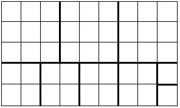
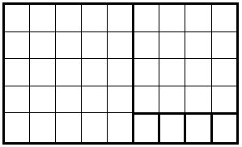

# Índice del problema

***

**Para volver a la lista haz clic [aquí](./Index.md)**

<!-- TOC -->
* [Índice del problema](#índice-del-problema)
* [Enunciado](#enunciado)
* [Solución](#solución)
    * [Salida de la solución](#salida-de-la-solución)
<!-- TOC -->

# Enunciado

***

Dado un papel de tamaño ``AxB``, determinar el número mínimo de 
cuadrados en los que se puede cortar el papel.

Supongamos un papel fuera de 9x5. Podríamos cortarlo de las
siguientes formas:

> Podríamos cortarlo en 3 cuadrados de 3x3, 4 cuadrados 
> de 2x2 y 2 cuadrados de 1x1, haciendo un total de 9 cuadrados
> 

Apliquemos la estrategia de recortar el cuadrado más grande 
que se pueda, teniendo como lado el menor de los dos números,
en nuestro ejemplo un cuadrado de 5x5

> * Como el papel era de 9x5, podremos hacer un cuadrado de 5x5, 
>   quedándonos un rectángulo de 5x4
> 
> 
> * A este rectángulo de 5x4 le aplicamos el mismo procedimiento,
>   recortando un cuadrado de 4x4, quedándonos un rectángulo de
>   4x1, que se recortará como 4 cuadrados de 1x1, siendo el total
>   de 6, mínimo.
> 
> 

# Solución
[Este problema](#enunciado) se puede resolver en C de la siguiente forma:
```c
#define FILAS /* Parámetro de entrada */
#define COLUMNAS /* Parámetro de entrada */

int min(int a, int b) {
    return a < b ? a : b;
}

int cuadrados(int filas, int columnas) {
    int celdasRestantes = filas * columnas;
    int numCuadrados = 0;

    while (celdasRestantes != 0) {

        // Selección: Me quedo con el menor para tomar su cuadrado
        int menor = min(filas, columnas);
        int resto = celdasRestantes % (menor * menor);
        int cociente = (celdasRestantes - resto) / (menor * menor);

        numCuadrados += cociente;   // Unión con la solución

        columnas = menor;           // Actualización de variables
        filas = resto / menor;
        celdasRestantes = resto;
    }

    return numCuadrados;            // Siempre es solución => se retorna
}
```

### Salida de la solución

```
Hacen falta 3 cuadrados para un papel de 36 x 24 cuadrados.
```