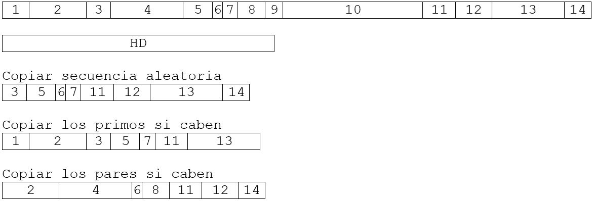

# Índice del problema

***

**Para volver a la lista haz clic [aquí](./Index.md)**

<!-- TOC -->
* [Índice del problema](#índice-del-problema)
* [Enunciado](#enunciado)
* [Solución](#solución)
    * [Algoritmo principal del problema](#algoritmo-principal-del-problema)
    * [Funciones auxiliares del algoritmo principal](#funciones-auxiliares-del-algoritmo-principal)
    * [Salida de la solución](#salida-de-la-solución)
<!-- TOC -->

# Enunciado

***

Sean ``n`` archivos ``(A_1, A_2, … , A_n)`` que debemos almacenar en un
disco. 

El archivo ``A_i`` requiere un espacio en disco de ``s_i``.

Se pide:
* **Problema 1**: Maximizar el número de archivos almacenados en el disco. 
* **Problema 2**: Queremos maximizar el espacio utilizado del disco.
* **Para ambos problemas**: Implementar un algoritmo o una heurística voraz que solucione este problema.

Demostrar que la implementación realizada devuelve siempre
la respuesta óptima (algoritmo) o bien dar un contraejemplo de
que no la devuelve (heurística).

> Numeramos los archivos y aplicamos 3 estrategias de ejemplo (NO VORACES):
> 
> 

# Solución
[Este problema](#enunciado) se puede resolver en C de la siguiente forma:

### Algoritmo principal del problema

```c
#define NUM_ARCHIVOS 13
#define TAM_HDD 1532

int sel = 0;    // Indica la heurística para el Problema 1 o el Problema 2

// Función de selección del primer problema: Tomar el primer valor más bajo posible
int seleccion1(ivector vector, int numArchivos) {
    for (int i = 0; i < numArchivos; ++i)
        if (vector[i] != -1)
            return i;
    return -1;
}

// Función de selección del segundo problema: Tomar el primer valor más alto posible
int seleccion2(ivector vector, int numArchivos){
    for (int i = numArchivos-1; i >= 0 ; --i)
        if (vector[i] != -1)
            return i;
    return -1;
}

ivector ficherosGreedy(ivector candidatos, int numArchivos, int tamDisco){

    ivector vSolucion = icreavector(numArchivos);
    for (int i = 0; i < numArchivos; ++i)
        vSolucion[i]=0;

    int contador = numArchivos;

    while (!solucion(vSolucion,numArchivos,tamDisco) && contador>0){

        int x = sel == 0 ? seleccion1(candidatos, numArchivos) : seleccion2(candidatos, numArchivos);
        int tamFicheroEscogido = candidatos[x];
        candidatos[x] = -1;                             // Quitar del conjunto Candidatos
        vSolucion[x] = tamFicheroEscogido;

        if(!factible(vSolucion,numArchivos,tamDisco))   // Si no es factible, lo quito del vector (ya está unido de antes)
            vSolucion[x]=-1;

        contador--;
    }

    return vSolucion;
}
```

### Funciones auxiliares del algoritmo principal
````c
// Función de solución para ambos ejercicios
int solucion(ivector vector, int numArchivos, int tamDisco){
    int ac = 0;
    for (int i = 0; i < numArchivos; ++i)
        if(vector[i]!=-1)
            ac += vector[i];
    return ac == tamDisco;
}

// Funcion si es la selección es factible
int factible(ivector vector,int numArchivos ,int tamDisco){
    int ac = 0;
    for (int i = 0; i < numArchivos; ++i)
        if(vector[i]!=-1 && ac <= tamDisco)
            ac += vector[i];
    return ac <= tamDisco;
}
````

### Salida de la solución

```
============= CANDIDATOS EJ 1 =============
(3      41      107     118     137     146     197     331     337     340     350     367     441)

============= EJ-1 =============
Caben 9 archivos de 13: 1417/1532 = 92.493477%
(3      41      107     118     137     146     197     331     337     -1      -1      -1      -1)

============= CANDIDATOS EJ 2 =============
(303    322     32      241     8       237     387     261     375     230     153     292     448)

============= EJ-2 =============
Caben 6 archivos: 1506/1532 = 98.302872%
(-1     -1      -1      -1      8       -1      -1      -1      375     230     153     292     448)
```