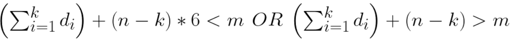

# Índice del problema

***

**Para volver a la lista haz clic [aquí](./Index.md)**

<!-- TOC -->
* [Índice del problema](#índice-del-problema)
* [Enunciado](#enunciado)
* [Solución](#solución)
    * [Salida de la solución](#salida-de-la-solución)
<!-- TOC -->

# Enunciado

***

Se dispone de ``n`` dados de 6 caras. Se desea conocer el número de
combinaciones que existen para conseguir una puntuación ``m`` dada con 
los ``n`` dados. 

Por ejemplo, si n=5, para sacar 6 (m=6), existen 5 formas:

|               |
|---------------|
| 1, 1, 1, 1, 2 |
| 1, 1, 1, 2, 1 |
| 1, 1, 2, 1, 1 |
| 1, 2, 1, 1, 1 |
| 2, 1, 1, 1, 1 |

**Guía**: una combinación parcial no es factible si ya es imposible obtener el valor o
si ya es seguro que se pasa. Si k es el número de dados ya tirados y n-k los que
faltan por tirar:



Es decir, con el número de dados que lleva, no debe de estar obligado a pasarse
ni obligado a quedarse corto. por ejemplo, si n=5:
- Con m=6, si lleva 4 dados (1, 1, 1, 3) o bien (1, 1, 1, 6) ya no es factible
- Con m=18, si lleva 3 dados (1, 1, 3) no es factible

# Solución
[Este problema](#enunciado) se puede resolver en C de la siguiente forma:

```c
#define N 5
#define CARAS 6
#define M 6

int llamadas = 0, iteraciones = 0;

void va(ivector v, int paso, int suma) {        // Solución: nodo hoja del árbol de exploración
    if (paso == N && suma == M) {
        mostrar(v,0,N-1,N);
    } else {                                     // Hay que seguir explorando las soluciones parciales
        if (suma + (N-paso) <= M)                // Poda: Mientras no se quede corto
        if (suma + (N-paso)*CARAS > M)           // Poda: Mientras no se cuele del objetivo
        for (int i = 1; i <= CARAS; ++i) {
            ++iteraciones;
            if ( suma+i <= M ) {                 // Poda: La acumulación es viable
                v[paso] = i;
                ++llamadas;
                va(v, paso+1, suma+i);
            }
        }
    }
}

int main() {
    ivector v = icreavector(N);
    va(v, 0, 0);
    printf("\nLlamadas recursivas: %i",llamadas);
    printf("\nIteraciones totales: %i",iteraciones);
    ifreevector(&v);
    return 0;
}
```

### Salida de la solución

```
1:  (1      1       1       1       2)
2:  (1      1       1       2       1)
3:  (1      1       2       1       1)
4:  (1      2       1       1       1)
5:  (2      1       1       1       1)

Llamadas recursivas: 40
Iteraciones totales: 90
```